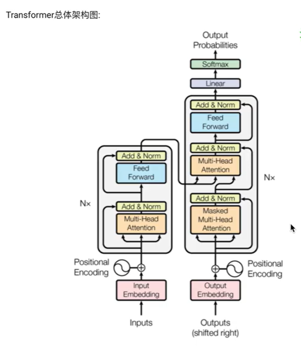

### 1.NLP:自然语言处理( Natural Language Processing, NLP)

### 2.LSTM
长短期记忆网络（Long-Short Term Memory,LSTM）论文首次发表于1997年。由于独特的设计结构，LSTM适合于处理和预测时间序列中间隔和延迟非常长的重要事件。

STM的核心是它的细胞状态（cell state），这条线贯穿整个链，允许信息以一种相对未经修改的形式流动，几乎没有任何阻碍。而门（gates）的结构用来保护和控制细胞状态，包括：

遗忘门（Forget Gate）：决定从细胞状态中丢弃什么信息。
输入门（Input Gate）：决定哪些新的信息被添加到细胞状态中。
输出门（Output Gate）：决定基于我们的细胞状态，输出什么值

### 3.GRU模型
GRU模型，全称为门控循环单元（Gated Recurrent Unit)
是一种用于处理序列数据的神经网络架构，与长短期记忆网络（LSTM）类似，但结构上更为简化。GRU是由Cho等人在2014年提出的，目的是为了解决传统循环神经网络（RNN）在处理长序列数据时容易出现的梯度消失或梯度爆炸问题。🌟

GRU通过引入两个门（门控机制）来调节信息的流动，这两个门分别是：

更新门（Update Gate）：决定多大程度上将新的信息融合进状态中。它控制着前一时刻的状态信息应该被保留多少，以及有多少新的信息应该被添加。
重置门（Reset Gate）：决定多大程度上将过去的信息抛弃。它允许模型决定是否完全忽略之前的状态信息，从而有助于捕捉数据中的短期依赖关系。
与LSTM相比，GRU的特点是模型结构更简单，因为它将LSTM中的遗忘门和输入门合并为一个更新门，且没有单独的细胞状态，这使得GRU在参数数量上少于LSTM，从而在某些情况下能够更快地训练和运行，同时仍然保持了对长期依赖关系的捕捉能力。

### 4.transformer
最初由Vaswani等人在2017年的论文《Attention is All You Need》中提出。
Transformer彻底改变了自然语言处理（NLP）领域的游戏规则，
因为它摒弃了之前广泛使用的循环神经网络（RNN）和长短期记忆网络（LSTM）的序列依赖处理方式，
转而使用了全新的机制——自注意力（Self-Attention）机制，来处理序列数据。

Transformer模型的主要特点包括：

1.自注意力机制：使模型能够同时考虑序列中所有单词之间的关系，不受序列长度限制，极大地提高了处理长序列的能力。
2.并行处理：与RNN和LSTM等基于序列的处理方式不同，Transformer可以同时处理整个序列，这大大提高了训练效率。
3.无需循环结构：摒弃了传统的循环结构，通过自注意力机制直接对序列中的任意两个位置进行建模，从而更有效地捕捉长距离依赖。
4.位置编码：由于Transformer不使用循环结构，为了让模型能够理解序列中单词的顺序，引入了位置编码（Positional Encoding）来提供每个单词的位置信息。

### 4. softmax归一化指数函数

用于帮助模型决定应该给予序列中的哪些部分更多的“注意力”。
自注意力机制中的Softmax
自注意力机制的计算可以分为以下几个步骤：

计算查询（Query）、键（Key）和值（Value）：对于输入序列中的每个元素，模型通过不同的权重矩阵生成查询（Q）、键（K）和值（V）。这些是自注意力机制的基础。

计算注意力分数：模型通过计算查询和所有键之间的点积，来确定序列中每个位置对于当前位置的重要性。这个点积后面会用softmax函数进行归一化处理。

应用Softmax：这就是我们的超级英雄登场的时刻了！😎 对于每个位置，模型会对所有注意力分数应用softmax函数。这一步的目的是将这些分数转换成概率分布，从而让模型能够决定在计算当前位置的输出时，应该给予序列中其他位置多少“注意力”。简单来说，softmax确保了所有的注意力分数加起来等于1，这样就可以像处理概率那样处理这些分数。

[ \text{Attention}(Q, K, V) = \text{softmax}\left(\frac{QK^T}{\sqrt{d_k}}\right)V ]

这里，(d_k)是键向量的维度，用于缩放点积，防止计算结果过大。

加权和：最后，模型使用softmax处理过的注意力分数对值（V）进行加权求和，得到每个位置的输出。

通过这种方式，Transformer利用softmax函数在自注意力机制中动态地分配注意力权重，这对于模型捕捉输入序列内部的复杂关系至关重要。这种机制不仅提高了模型处理长距离依赖的能力，也使得Transformer能够在多种自然语言处理任务中取得卓越的表现。🚀

所以，可以说，在Transformer中，softmax不仅仅是一个数学函数，它是让自注意力机制发挥强大作用的关键！

## 一.transformer 详解

### 2.1 认识Transformer架构

Transformer模型的作用:
基于seq2seq架构的transformer模型可以完成NLP领域研究的典型任务,如机器翻译,文本生成等.
同时又可以构建预训练语言模型，用于不同任务的迁移学习.

II.总体架构：
输入部分
输出部分
编码器部分
解码器部分

III.输入部分包含:
源文本嵌入层及其位置编码器
目标文本嵌入层及其位置编码器

III.输出部分包含:
线性层
softmax处理器

III.编码器部分:
由N个编码器层堆叠而成
每个编码器层由两个子层连接结构组成
第一个子层连接结构包括一个多头自注意力子层和规范化层以及一个残差连接
第二个子层连接结构包括一个前馈全连接子层和规范化层以及一个残差连接

III.解码器部分:
由N个解码器层堆叠而成
每个解码器层由三个子层连接结构组成
第一个子层连接结构包括一个多头自注意力子层和规范化层以及一个残差连接
第二个子层连接结构包括一个多头注意力子层和规范化层以及一个残差连接

2.2 输入部分实现
2.3 编码器部分实现
2.3.1 掩码张量
2.3.2 注意力机制
2.3.3 多头注意力机制
2.3.4 前馈全连接层
2.3.5 规范化层
2.3.6 子层连接结构
2.3.7 编码器层
2.3.8 编码器
2.4 解码器部分实现
2.4.1 解码器层
2.4.2 解码器
2.5 输出部分实现
2.6 模型构建
2.7 模型基本测试运行

