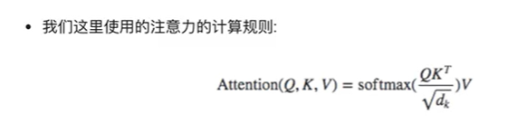
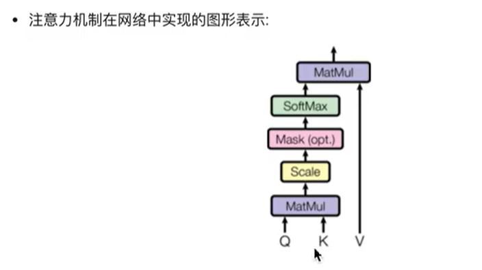

### 1.NLP:自然语言处理( Natural Language Processing, NLP)

### 2.LSTM
长短期记忆网络（Long-Short Term Memory,LSTM）论文首次发表于1997年。由于独特的设计结构，LSTM适合于处理和预测时间序列中间隔和延迟非常长的重要事件。

STM的核心是它的细胞状态（cell state），这条线贯穿整个链，允许信息以一种相对未经修改的形式流动，几乎没有任何阻碍。而门（gates）的结构用来保护和控制细胞状态，包括：

遗忘门（Forget Gate）：决定从细胞状态中丢弃什么信息。
输入门（Input Gate）：决定哪些新的信息被添加到细胞状态中。
输出门（Output Gate）：决定基于我们的细胞状态，输出什么值

### 3.GRU模型
GRU模型，全称为门控循环单元（Gated Recurrent Unit)
是一种用于处理序列数据的神经网络架构，与长短期记忆网络（LSTM）类似，但结构上更为简化。GRU是由Cho等人在2014年提出的，目的是为了解决传统循环神经网络（RNN）在处理长序列数据时容易出现的梯度消失或梯度爆炸问题。🌟

GRU通过引入两个门（门控机制）来调节信息的流动，这两个门分别是：

更新门（Update Gate）：决定多大程度上将新的信息融合进状态中。它控制着前一时刻的状态信息应该被保留多少，以及有多少新的信息应该被添加。
重置门（Reset Gate）：决定多大程度上将过去的信息抛弃。它允许模型决定是否完全忽略之前的状态信息，从而有助于捕捉数据中的短期依赖关系。
与LSTM相比，GRU的特点是模型结构更简单，因为它将LSTM中的遗忘门和输入门合并为一个更新门，且没有单独的细胞状态，这使得GRU在参数数量上少于LSTM，从而在某些情况下能够更快地训练和运行，同时仍然保持了对长期依赖关系的捕捉能力。

### 4.transformer
最初由Vaswani等人在2017年的论文《Attention is All You Need》中提出。
Transformer彻底改变了自然语言处理（NLP）领域的游戏规则，
因为它摒弃了之前广泛使用的循环神经网络（RNN）和长短期记忆网络（LSTM）的序列依赖处理方式，
转而使用了全新的机制——自注意力（Self-Attention）机制，来处理序列数据。

Transformer模型的主要特点包括：

1.自注意力机制：使模型能够同时考虑序列中所有单词之间的关系，不受序列长度限制，极大地提高了处理长序列的能力。
2.并行处理：与RNN和LSTM等基于序列的处理方式不同，Transformer可以同时处理整个序列，这大大提高了训练效率。
3.无需循环结构：摒弃了传统的循环结构，通过自注意力机制直接对序列中的任意两个位置进行建模，从而更有效地捕捉长距离依赖。
4.位置编码：由于Transformer不使用循环结构，为了让模型能够理解序列中单词的顺序，引入了位置编码（Positional Encoding）来提供每个单词的位置信息。

### 4. softmax归一化指数函数

用于帮助模型决定应该给予序列中的哪些部分更多的“注意力”。
自注意力机制中的Softmax
自注意力机制的计算可以分为以下几个步骤：

计算查询（Query）、键（Key）和值（Value）：对于输入序列中的每个元素，模型通过不同的权重矩阵生成查询（Q）、键（K）和值（V）。这些是自注意力机制的基础。

计算注意力分数：模型通过计算查询和所有键之间的点积，来确定序列中每个位置对于当前位置的重要性。这个点积后面会用softmax函数进行归一化处理。

应用Softmax：这就是我们的超级英雄登场的时刻了！😎 对于每个位置，模型会对所有注意力分数应用softmax函数。这一步的目的是将这些分数转换成概率分布，从而让模型能够决定在计算当前位置的输出时，应该给予序列中其他位置多少“注意力”。简单来说，softmax确保了所有的注意力分数加起来等于1，这样就可以像处理概率那样处理这些分数。

[ \text{Attention}(Q, K, V) = \text{softmax}\left(\frac{QK^T}{\sqrt{d_k}}\right)V ]

这里，(d_k)是键向量的维度，用于缩放点积，防止计算结果过大。

加权和：最后，模型使用softmax处理过的注意力分数对值（V）进行加权求和，得到每个位置的输出。

通过这种方式，Transformer利用softmax函数在自注意力机制中动态地分配注意力权重，这对于模型捕捉输入序列内部的复杂关系至关重要。这种机制不仅提高了模型处理长距离依赖的能力，也使得Transformer能够在多种自然语言处理任务中取得卓越的表现。🚀

所以，可以说，在Transformer中，softmax不仅仅是一个数学函数，它是让自注意力机制发挥强大作用的关键！

## 一.transformer 详解

1.1 Transformer 诞生

1.1 Transformer的诞生
2018年10月，Google发出一篇论文《BERT:Pre-trainingof Deep Bidirectional Transformers forLanguage Understanding》,BRT模型橫空出世,并横扫NLP领域11项任务的最佳成绩!

论文地址: https://arxiv.org/pdf/1810.04805.pdf

而在BERT中发挥重要作用的结构就是Transformer,之后又相继出现XLNET，rOBERT等模型击败了BERT，
但是他们的核心没有变，仍然是:Transformer.

### 2.1 认识Transformer架构

Transformer模型的作用:
基于seq2seq架构的transformer模型可以完成NLP领域研究的典型任务,如机器翻译,文本生成等.
同时又可以构建预训练语言模型，用于不同任务的迁移学习.

II.总体架构：
输入部分
输出部分
编码器部分
解码器部分

III.输入部分包含:
源文本嵌入层及其位置编码器
目标文本嵌入层及其位置编码器

III.输出部分包含:
线性层
softmax处理器

III.编码器部分:
由N个编码器层堆叠而成
每个编码器层由两个子层连接结构组成
第一个子层连接结构包括一个"多头自注意力子层"和"规范化层"以及一个残差连接
第二个子层连接结构包括一个"前馈全连接子层"和"规范化层"以及一个残差连接

III.解码器部分:
由N个解码器层堆叠而成
每个解码器层由三个子层连接结构组成
第一个子层连接结构包括一个"多头自注意力子层"和"规范化层"以及一个残差连接
第二个子层连接结构包括一个"多头注意力子层"和"规范化层"以及一个残差连接
第三个子层连接结构包括一个"前馈全连接子层"和"规范化层"以及一个"残差连接"

### 2.2 输入部分实现
/

学习目标:
了解文本嵌入层和位置编码的作用
掌握文本嵌入层和位置编码的实现过程

输入部分包含:
源文本嵌入层及其位置编码器
目标文本嵌入层及其位置编码器。

文本嵌入层的作用:
无论是源文本嵌入还是目标文本嵌入，都是为了将文本中词汇的数字表示转变为向量表示
希望在这样的高维空间捕捉词汇间的关系.

PyTorch py火炬

#导入必备的工具包
import torch

#预定义的网络层torch.nn，工具开发者已经帮助我们开发好的一些常用层#比如，卷积层，1stm层，embedding层等，不需要我们再重新造轮子
import torch.nn as nn

# 数学计算工具包
import math
# torch中变量封装函数Variable.
from torch.autograd import Variable

Transformer架构解析

lesson3_transformer.py
import torch
import torch.nn as nn
import torch.nn.functional as F
from torch.autograd import Variable
import math
# pip install matplotlib
import matplotlib.pyplot as plt
import numpy as np
import copy

class Embeddings(nn.Module):
def __init__(self, d_model, vocab):
# dmodel:词嵌入的维度
# vocab:词表的大小
super(Embeddings, self).__init__()
# 定义Embedding层
self.lut = nn.Embedding(vocab, d_model)
# 将参数传入类中
self.d_model = d_model

    def forward(self, x):
         # x:代表输入进模型的文本通过词汇映射后的数字张量
         return self.lut(x) * math.sqrt(self.d_model)

d_model=512
vocab=1000

x= Variable(torch.LongTensor([[100,2,421,508],[491,998,1,221]]))
emb= Embeddings(d_model,vocab)
embr=emb(x)
print("embr:",embr)
print(embr.shape)

2.3 编码器部分实现

学习目标:
了解编码器中各个组成部分的作用
掌握编码器中各个组成部分的实现过程

编码器部分:
由N个编码器层堆叠而成
每个编码器层由两个子层连接结构组成
第一个子层连接结构包括一个多头自注意力子层和规范化层以及一个残差连接
第二个子层连接结构包括一个前馈全连接子层和规范化层以及一个残差连接

2.3.1 掩码张量

2.3.2 注意力机制

学习目标:
了解什么是注意力计算规则和注意力机制
掌握注意力计算规则的实现过程

什么是注意力:(关键词提示)
我们观察事物时，之所以能够快速判断一种事物(当然允许判断是错误的),是因为我们大脑南能够很快把注意力放在事物最具有辨识度的部分从而作出判断，
而并非是从头到尾的观察一遍事物后，才能有判断结果.正是基于这样的理论，就产生了注意力机制.

什么是注意力计算规则:
它需要三个指定的输入Q(query),K(key),V(value),然后通过公式得到注意力的计算结果,
这个结果代表query在key和value作用下的表示,而这个具体的计算规则有很多种,我这里只介绍我们用到的这一种.

QKV是自然语言处理中Transformer模型的一个重要概念，特别是在模型的自注意力（Self-Attention）机制中。QKV分别代表Query（查询）、Key（键）和Value（值）。这三个部分是自注意力机制中计算注意力权重的关键要素。

Query（查询）: 你可以把它想象成一个问题，它是当前我们想要获取更多信息的部分。
Key（键）: 它们像是一系列问题的答案，我们会用它们来评估每个问题的相关性。
Value（值）: 一旦我们知道了哪些键（答案）与我们的查询（问题）最相关，我们就会查看与这些键对应的值，这些值包含了我们想要聚焦的实际信息。
在自注意力过程中，我们会计算每个查询与所有键的相似度，这些相似度被用作权重来加权对应的值。
这样，每个位置的输出就是一个加权和，其中更相关的信息会得到更多的关注。
这个机制允许模型在处理一个序列时，能够考虑到序列中各个部分之间的关系，从而捕捉到更加丰富的上下文信息。

我们这里使用的注意力的计算规则:

学习了Q,K,V的比喻解释:
Q是一段准备被概括的文本;K是给出的提示;V是大脑中的对提示K的延伸
当Q=K=V时,称作自注意力机制.

什么是注意力机制:
注意力机制是注意力计算规则能够应用的深度学习网络的载体,除了注意力计算规则外,
还包括一些必要的全连接层以及相关张量处理,使其与应用网络融为一体.
使用自注意力计算规则的注意力机制称为自注意力机制.

2.3.3 多头注意力机制
2.3.4 前馈全连接层

2.3.4 前馈全连接层

学习目标:
了解什么是前馈全连接层及其它的作用
掌握前馈全连接层的实现过程.

什么是前馈全连接层:
在Transformer中前馈全连接层就是具有两层线性层的全连接网络

前馈全连接层的作用:
考虑注意力机制可能对复杂过程的拟合程度不够,通过增加两层网络来增强模型的能力

2.3.5 规范化层
2.3.6 子层连接结构
2.3.7 编码器层
2.3.8 编码器
2.4 解码器部分实现
2.4.1 解码器层
2.4.2 解码器
2.5 输出部分实现
2.6 模型构建

1.1 认识fasttext工具
学习目标:
了解fasttext工具的作用.
了解fasttext工具的优势及其原因.
掌握fasttext的安装方法,

fastText作为NLP工程领域常用的工具包,fasttext有两大作用:

进行文本分类
训练词向量

文本分类的种类:
二分类:
文本被分类两个类别中,往往这两个类别是对立面,比如: 判断一句评论是好评还是差评.

单标签多分类:
文本被分入到多个类别中,且每条文本只能属于某一个类别(即被打上某一个标签),比如: 输入一个人名,判断它是来自哪个国家的人名

多标签多分类:
文本被分人到多个类别中,但每条文本可以属于多个类别(即被打上多个标签),比如: 输入一段描述,判断可能是和哪些兴趣爱好有关,一段描述中可能即讨论了美食,又太讨论了游戏爱好.

什么是词向量迁移:
使用在大型语料库上已经进行训练完成的词向量模型
fasttext工具中可以提供的可迁移的词向量:

fasttext提供了157种语言的在CommonCrawl和Wikipedia语料上进行训练的可迁移词向量模型,它们采用CBOW模式进行训练,词向量维度为300维,
可通过该地址查看具体语言词向量模型: https://fasttext.cc/docs/en/crawl-vectors.html

fasttext提供了294种语言的在Wikipedia语料上进行训练的可迁移词向量模型,它们采用skipgram模式进行训练,词向量维度同样是300维,
可通过该地址查看具体语言词向量模型:https://fasttext.cc/docs/en/pretrained-vectors.html

2.7 模型基本测试运行

